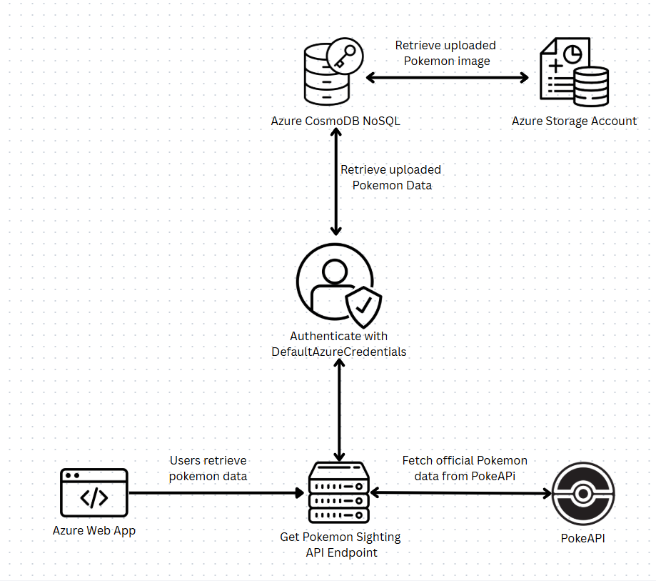
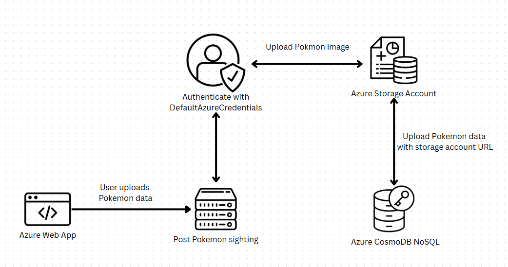
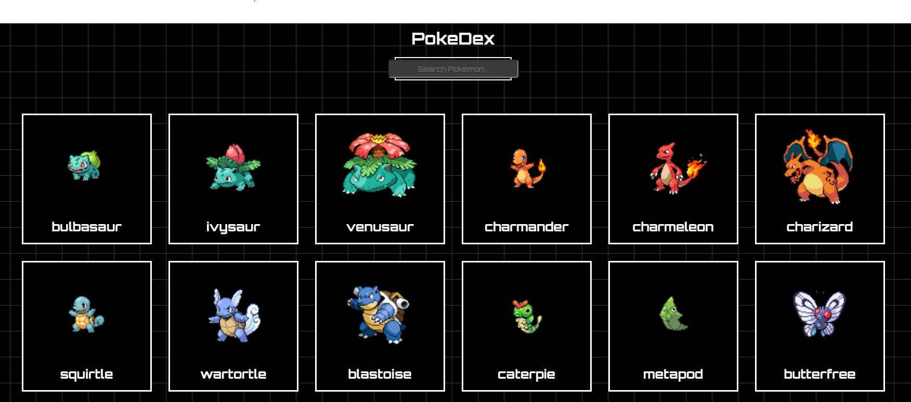
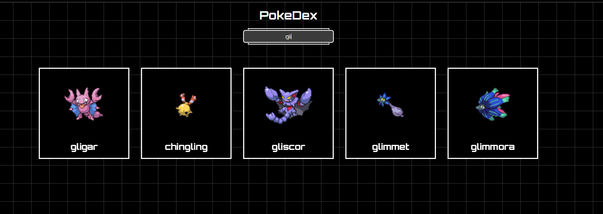
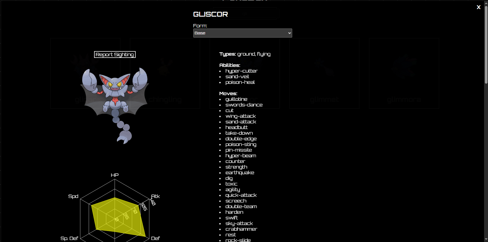
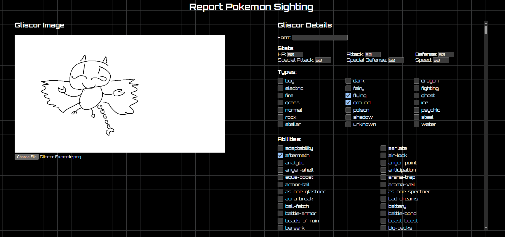
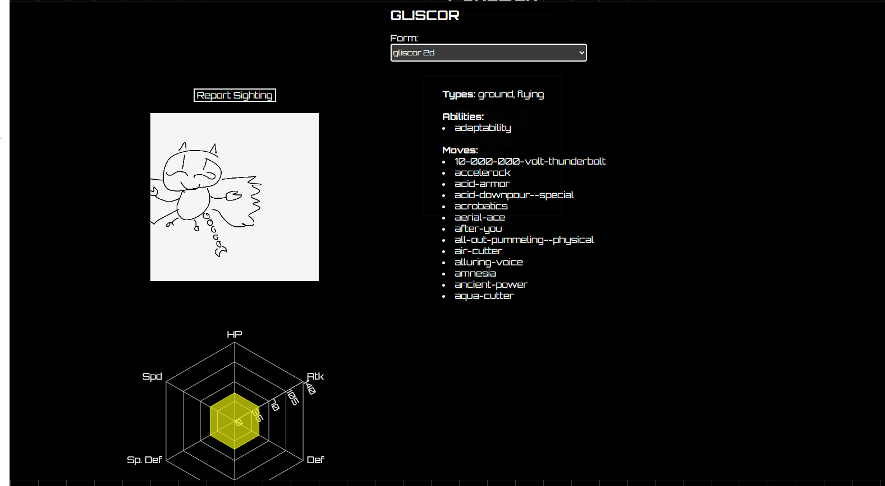

# Pokemon Sightings

## Project Description
This is a whimsical project inspired by the PokéDex, where users can "report sightings" of their own custom Pokémon designs—just like stumbling upon a mysterious creature in the wild! Think of it as a creative safari through a fan-made Pokémon universe, where each upload captures the magic of a rare encounter.

## Infrastructure
- Azure Web App (Hosting web application)
- Azure Container Registry (Storing the web application docker image)
- Azure Container Instance (Running the container for development/testing purposes)
- Azure Storage Account (Store uploaded pokemon images)
- Azure CosmosDB (Store uploaded pokemon data)
- Azure Log Analytics (Store storage account, CosmosDB, and web app logs)

### Retrieve Pokemon

### Post Pokemon

## Features

### Home Page

- Features all 1025 pokemon
- Allows the user to search for subset of pokemon 

### Info Window

- When a user clicks on a card, they will be able to see more detailed information on the pokemon:
  - Picture
  - Type
  - Abilities
  - Moves
  - Stats
  - Forms

- The user can click on the form dropdown to look at different designs that have been reported by other users
- Data is retrieved from [PokeAPI](https://pokeapi.co/docs/v2), Azure storage account, and Azure CosmosDB. 
- The user can click the Report Sighting button to upload their own design

### Pokemon Design Submission

- Along with uploading their design, the user will be able to choose a name, type combination, ability, stat, and move set for their pokemon
- After successfully submitting their design, the user can see their design by navigating back to the home screen, and selecting the pokemon they uploaded a sighting for
- The image is stored in an Azure storage account and the form name, stats, types, abilities, and moves are stored in an Azure CosmosDB account
